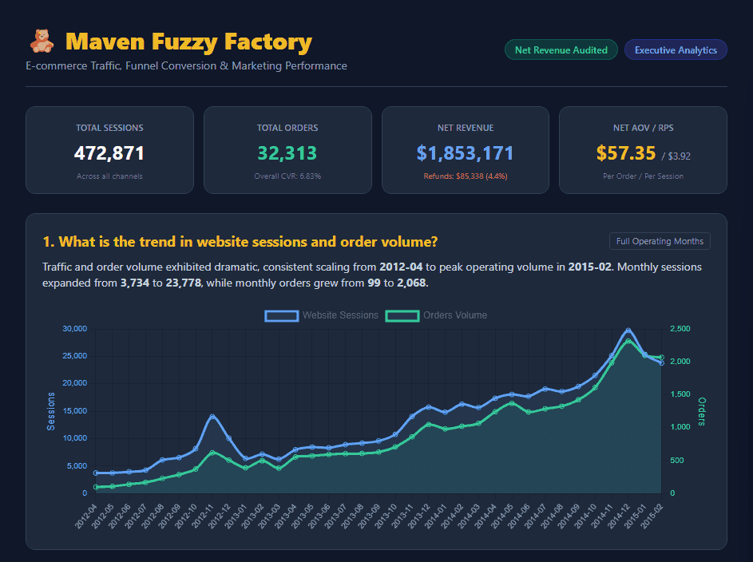
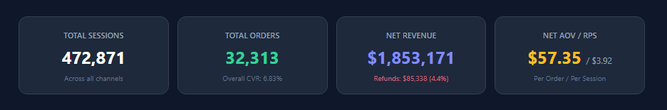
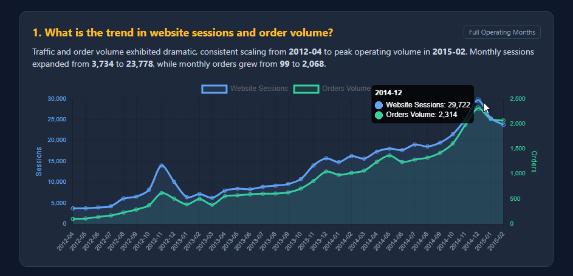
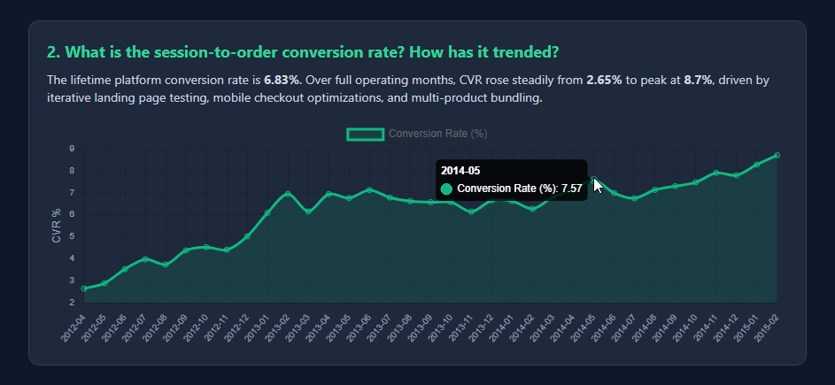
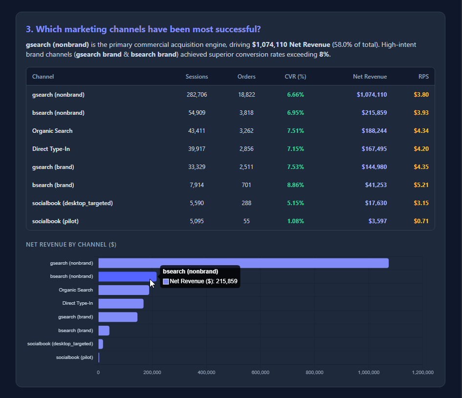
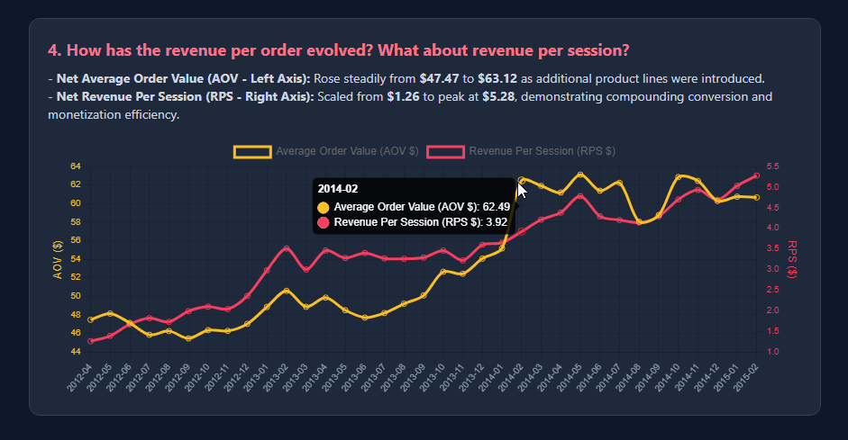

<div align="center">

  # 🧸 Maven Fuzzy Factory — E-Commerce Revenue & Traffic Analytics
  ### Automated E-Commerce Data Pipeline & Mobile-Optimized Executive HTML Dashboard
  
  [](https://aly-hossam.github.io/ecommerce-revenue-analytics/)

  <p align="center">
    <a href="#-executive-summary--key-kpis">Executive Summary</a> •
    <a href="#-key-business-questions--strategic-insights">Strategic Insights</a> •
    <a href="#-data-pipeline--quality-logic">Data Pipeline Logic</a> •
    <a href="#-repository-architecture">Architecture</a> •
    <a href="#-how-to-run-the-project">How to Run</a>
  </p>

  <!-- Badges -->
  <p align="center">
    
    
    
    
    
    
  </p>

</div>

---

## 💡 Project Overview

An executive-level data analytics pipeline evaluating web traffic, conversion funnels, marketing channel ROI, and unit economics for **Maven Fuzzy Factory** (an e-commerce retailer). 

This project features an automated Python data pipeline, net revenue reconciliation (deducting customer refunds from gross sales), and a mobile-optimized **Interactive HTML Executive Dashboard** (`fuzzy_factory_report.html`).

---

## 🖥️ Interactive Dashboard Demo

<div align="center">
  <a href="https://aly-hossam.github.io/ecommerce-revenue-analytics/">
    
  </a>

  <br/><br/>

  [](https://aly-hossam.github.io/ecommerce-revenue-analytics/)
</div>

---

## 📌 Executive Summary & Key KPIs

Over a 3-year operating period (**April 2012 – February 2015**), the platform scaled significantly across all primary commercial metrics:

<div align="center">
  
</div>

<br/>

### 🎯 Primary Commercial Benchmarks Evaluated:
- 🌐 **Total Website Sessions:** `472,871`
- 🛍️ **Total Completed Orders:** `32,313`
- 💵 **Net Revenue:** `$1,853,171` *(Gross Revenue: $1,938,510 less $85,338 refunds / 4.4% refund rate)*
- 📈 **Lifetime Conversion Rate (CVR):** `6.83%` *(Grew from 3.19% to peak at 8.70%)*
- 🏷️ **Net Average Order Value (AOV):** `$57.35` *(Evolved from $49.16 to $63.12)*
- ⚡ **Net Revenue Per Session (RPS):** `$3.92` *(Scaled from $1.57 to $5.28)*

---

## 🎯 Key Business Questions & Strategic Insights

### 1. What is the trend in website sessions and order volume?
> **Executive Insight:** Traffic and orders demonstrated exponential growth. Monthly sessions expanded from **1,879** to peak at **29,722**, while monthly orders grew from **60** to **2,314**.

<div align="center">
  
</div>

*Methodology Note: Data line trends exclude partial cutoff months (March 2012 & March 2015) to eliminate false "cliff drop" visualization effects.*

---

### 2. What is the session-to-order conversion rate? How has it trended?
> **Executive Insight:** CVR more than doubled over the platform lifecycle—rising from **3.19%** in early 2012 to **8.70%** in early 2015, driven by landing page testing and checkout funnel optimization.

<div align="center">
  
</div>

---

### 3. Which marketing channels have been most successful?
> **Volume Leader:** `gsearch (nonbrand)` is the primary acquisition engine, generating **$1,074,110 Net Revenue** (58.0% of total company revenue).  
> **Brand Retention:** Unpaid channels (`Direct Type-In` and `Organic Search`) generated combined net revenues exceeding **$355,000**, reflecting compounding brand equity.

<div align="center">
  
</div>

---

### 4. How has revenue per order (AOV) and revenue per session (RPS) evolved?
> **Monetization Scaling:** Net AOV grew from **$49.16** to **$63.12** due to product cross-selling, while Net RPS surged from **$1.57** to **$5.28**, proving strong traffic monetization efficiency.

<div align="center">
  
</div>

---

## 🔍 Data Pipeline & Quality Logic

1. **Net Revenue Reconciliation:** Integrates `order_item_refunds.csv` to deduct $85,338 in customer refunds from gross sales, calculating true Net Revenue ($1,853,171).
2. **Dual-Axis Visualization Alignment:** Placed AOV ($44–$64) and RPS ($1.5–$5.5) on separate, synchronized Y-axes to prevent metric scale flattening.
3. **Partial Month Censoring Corrections:** Isolates complete operating months (`2012-04` through `2015-02`) for time-series trendlines to prevent distorted conclusions.
4. **Mobile UX Formatting:** Converted channel attribution charts into horizontal bar formats (`indexAxis: 'y'`) and formatted currency tables for responsive viewports.

---

## 🛠️ Repository Architecture

```text
.
├── assets/                          # Screenshots and demo GIFs
│   ├── dashboard-demo.gif
│   ├── 00-KPIs.png
│   ├── 01-sessions-orders-trend.png
│   ├── 02-conversion-rate-trend.png
│   ├── 03-marketing-channels-performance.png
│   └── 04-aov-rps-growth.png
├── extracted_files/
│   └── Maven+Fuzzy+Factory/
│       ├── orders.csv
│       ├── order_items.csv
│       ├── order_item_refunds.csv
│       ├── products.csv
│       ├── website_pageviews.csv
│       └── website_sessions.csv
├── a.py                             # CLI Tool: Scan, extract, & profile datasets
├── analyze_fuzzy_factory.py         # Main analytics pipeline & HTML dashboard generator
├── fuzzy_factory_report.html        # Standalone interactive HTML dashboard
├── data_overview_report.md         # Auto-generated Markdown data profiling report
└── README.md                        # Project documentation
```

---

## ⚡ How to Run the Project

### 1. Prerequisites
Ensure Python 3.8+ and `pandas` are installed:
```bash
pip install pandas
```

### 2. Execution Modes via `a.py` (CLI Tool)
- **Mode 1 (Scan Directory):**
  ```bash
  python3 a.py 1
  ```
- **Mode 2 (Extract Archives into Folders):**
  ```bash
  python3 a.py 2
  ```
- **Mode 3 (Automated Data Profiling):**
  ```bash
  python3 a.py 3
  ```

### 3. Generate Interactive HTML Dashboard
Run the main analytics engine:
```bash
python3 analyze_fuzzy_factory.py
```
Open `fuzzy_factory_report.html` (or `index.html`) in any desktop or mobile browser.

---

## 👤 Author & Contact

**Aly Hossam**  
*Data Analytics Engineer | Building 100% Offline, Secure Executive Dashboards*

- 💼 **LinkedIn:** [linkedin.com/in/aly-hossam](https://linkedin.com/in/aly-hossam)
- 🛒 **Gumroad:** [alyhossam.gumroad.com](https://alyhossam.gumroad.com)
- 📧 **Email:** `aly.hossam.2002@gmail.com`

---
<div align="center">
  <sub>Dataset Source: Public Domain Maven Analytics. Built for E-Commerce Data Analytics Portfolio.</sub>
</div>
